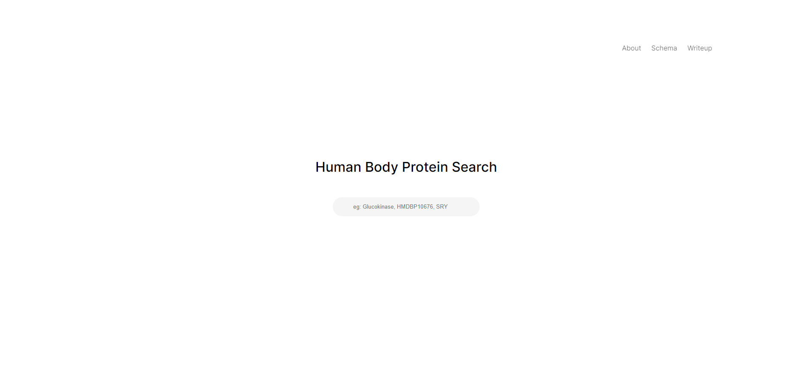
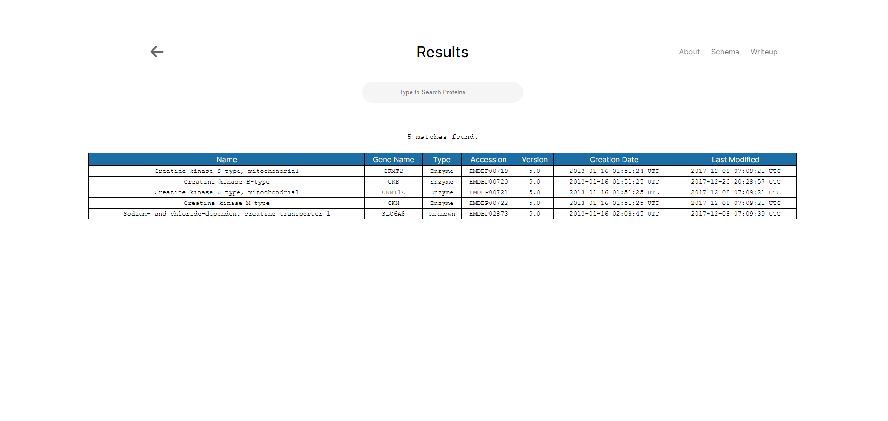
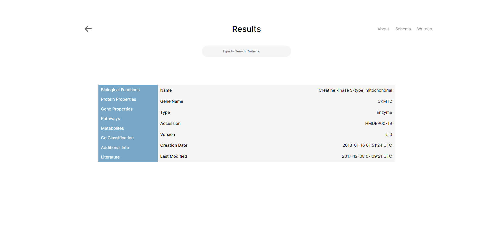
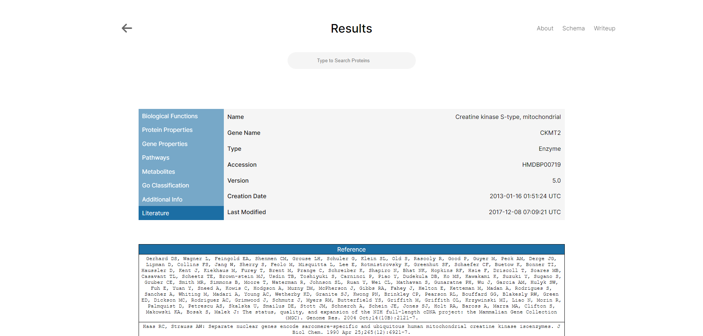

# Human Body Protein Search Engine

**Author:** Dien "Ethan" Mach (dmach1)  
**GitHub Repository:** [https://github.com/e10m/hmdb_website_google_cloud](https://github.com/e10m/hmdb_website_google_cloud)

---

## Overview

The Human Body Protein Search Engine is a web-based application designed to provide quick and intuitive access to detailed information about proteins and enzymes found within the human body. Inspired by the Human Metabolite Database (HMDB), this project aims to offer a modern, streamlined, and user-friendly interface for researchers, students, and professionals in the life sciences.

> **Note:** The live website is no longer hosted due to operational costs. This README and the accompanying GitHub repository provide a comprehensive overview of the project's functionality, design, and implementation.

---

## Table of Contents

- [Technologies Used](#technologies-used)
- [Project Motivation](#project-motivation)
- [Implementation Details](#implementation-details)
  - [Data Acquisition and Parsing](#data-acquisition-and-parsing)
  - [Database Design](#database-design)
  - [Web Application Development](#web-application-development)
  - [User Interface and Experience](#user-interface-and-experience)
- [Screenshots](#screenshots)
- [Challenges and Solutions](#challenges-and-solutions)
- [Learning Outcomes](#learning-outcomes)
- [Future Enhancements](#future-enhancements)
- [Acknowledgments](#acknowledgments)
- [Contact Information](#contact-information)
- [References](#references)

---

## Technologies Used

- **Front-End Development:**
  - HTML5
  - CSS3
  - JavaScript (ES6+)
  - jQuery
- **Back-End Development:**
  - Python CGI Scripts
  - MySQL Database
- **Data Parsing and Management:**
  - Python for XML parsing and data extraction
  - MySQL for database schema design and data storage
- **Server and Deployment:**
  - Apache HTTP Server
  - Hosted on Google Cloud Compute Engine (now offline)
- **Version Control and Collaboration:**
  - Git and GitHub for source code management

---

## Project Motivation

The existing HMDB website, while comprehensive, could benefit from a more modern and streamlined user interface. This project was undertaken to:

- Improve the accessibility and usability of protein data.
- Demonstrate proficiency in full-stack web development and database management.
- Apply bioinformatics knowledge to create a practical tool for the scientific community.

---

## Implementation Details

### Data Acquisition and Parsing

- **Data Source:** Protein data was obtained from the HMDB in XML format.
- **Parsing:** Utilized Python's `xml.etree.ElementTree` library to parse the XML files and extract relevant protein information.
- **Database Population:** Processed data was structured and inserted into a MySQL database, ensuring efficient storage and retrieval.

### Database Design

- **Schema:** Designed a robust MySQL database schema to manage relationships between proteins, genes, functions, literature references, and other related entities.
- **Optimization:** Indexed key fields to enhance query performance and ensure rapid search results.

### Schema Diagram

  
*A diagram showcasing the relational database schema and relationships between proteins and their associated entities.*

### Web Application Development

- **Front-End:**
  - Created responsive web pages using HTML and CSS.
  - Implemented interactive features with JavaScript and jQuery for seamless user interactions.
  - Focused on clean design principles to enhance readability and navigation.

- **Back-End:**
  - Developed Python CGI scripts to handle server-side processing.
  - Established communication between the web interface and the MySQL database to enable dynamic content rendering.

### User Interface and Experience

- **Search Functionality:**
  - Implemented a versatile search bar allowing queries by protein name, HMDB accession number, gene name, or biological terms.
  - Displayed search results in a tabulated format with clickable entries for detailed information.

- **Protein Information Display:**
  - Categorized protein details into sections such as Biological Functions, Pathways, and Literature.
  - Enabled users to navigate through different categories using intuitive buttons and links.

---

## Screenshots

Since the live website is no longer available, the following screenshots demonstrate the application's functionality:

### Home Page

  
*Landing page with a search bar for querying proteins.*

### Search Results

  
*Displaying results for the query "Creatine".*

### Protein Details

  
*Detailed information about the selected protein, with navigation to specific categories like Literature.*

### Additional Details

  
*Further details about the literature related to the target protein.*

---

## Challenges and Solutions

- **Data Volume and Complexity:**
  - **Challenge:** Parsing and managing a large XML dataset with complex hierarchical structures.
  - **Solution:** Implemented efficient parsing algorithms and designed a normalized database schema to handle relationships and ensure data integrity.

- **Performance Optimization:**
  - **Challenge:** Ensuring fast query responses despite the sizable dataset.
  - **Solution:** Indexed database fields and optimized SQL queries. Implemented asynchronous loading where appropriate.

- **User Interface Design:**
  - **Challenge:** Creating an interface that is both informative and user-friendly.
  - **Solution:** Adopted modern web design practices and focused on simplicity and ease of navigation.

---

## Learning Outcomes

- **Full-Stack Development Skills:** Gained hands-on experience in both front-end and back-end development.
- **Database Management:** Enhanced skills in designing and managing relational databases with MySQL.
- **Data Parsing:** Learned to efficiently parse and process XML data using Python.
- **Problem-Solving:** Overcame technical challenges related to data handling, performance optimization, and user interface design.
- **Bioinformatics Application:** Applied theoretical knowledge to create a practical tool for accessing biological data.

---

## Future Enhancements

- **Implement HTTPS:** Enhance security by configuring SSL certificates for secure communication.
- **Responsive Design:** Further optimize the interface for mobile and tablet devices.
- **Advanced Search Features:** Introduce filtering options and advanced query capabilities.

---

## Acknowledgments

- **Human Metabolome Database (HMDB):** Data source for protein information.
  - Website: [https://hmdb.ca/](https://hmdb.ca/)
- **Contributors and Supporters:** Thank you to everyone who provided feedback and assistance throughout the development of this project.

---

## Contact Information

For more information about the project or to discuss potential collaborations, please contact:

**Dien "Ethan" Mach**  
Email: [dienethanmach@gmail.com](mailto:dienethanmach@gmail.com)  
GitHub: [e10m](https://github.com/e10m)

---

## References

1. **Wishart DS**, Tzur D, Knox C, et al. HMDB: the Human Metabolome Database. *Nucleic Acids Res.* 2007 Jan;35(Database issue):D521-6. PMID: [17202168](https://pubmed.ncbi.nlm.nih.gov/17202168/)
2. **Wishart DS**, Knox C, Guo AC, et al. HMDB: a knowledgebase for the human metabolome. *Nucleic Acids Res.* 2009 Jan;37(Database issue):D603-10. PMID: [18953024](https://pubmed.ncbi.nlm.nih.gov/18953024/)
3. **Wishart DS**, Jewison T, Guo AC, et al. HMDB 3.0—The Human Metabolome Database in 2013. *Nucleic Acids Res.* 2013 Jan;41(D1):D801-7. PMID: [23161693](https://pubmed.ncbi.nlm.nih.gov/23161693/)
4. **Wishart DS**, Feunang YD, Marcu A, et al. HMDB 4.0—The Human Metabolome Database for 2018. *Nucleic Acids Res.* 2018 Jan;46(D1):D608-17. PMID: [29140435](https://pubmed.ncbi.nlm.nih.gov/29140435/)
5. **Wishart DS**, Guo AC, Oler E, et al. HMDB 5.0: the Human Metabolome Database for 2022. *Nucleic Acids Res.* 2022 Jan;50(D1):D622–31. PMID: [34986597](https://pubmed.ncbi.nlm.nih.gov/34986597/)

---

**Note to Employers:** While the live deployment is offline, the comprehensive documentation and codebase available in the GitHub repository showcase the project's full functionality and demonstrate my capabilities in web development and bioinformatics. I welcome the opportunity to discuss this project further and answer any questions you may have.

---

Feel free to use this revised version in your GitHub repository. If you have any further questions or need additional assistance, don't hesitate to ask!
